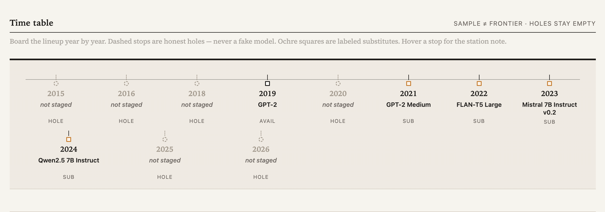

# LLMTimeMachine

**Your prompt, answered by a decade of AI. A time machine for language models — board the lineup year by year and get your prompt answered by the model of its era, from GPT-2 to the frontier. (Work in progress).**



A laptop-compatible, auditable sample of LLM history. It is **not** a verified record of the best model in every year.

This is the **local demo** of Gwern's [LLM Time Travel Visualization Proposal](https://gwern.net/blog/2026/llm-timetravel) (`idea.md`): one prompt, a frozen historical cohort, chronological reveal, full audit trail, local-only storage. 

## Quick start

```bash
# 1) Create a virtualenv and install (editable + dev)
uv sync --dev

# 2) Run the automated suite (no model weights required)
uv run pytest

# 3) Launch the UI on loopback only
uv run streamlit run app.py --server.address 127.0.0.1 --server.port 8501
```

Open http://127.0.0.1:8501

The sidebar defaults to the **composite** runner (transformers + llama.cpp by backend). Select **fake** for no downloads and no network. Use it to explore the trip timeline, audit drawers, blind compare, export, and delete.

## What you get

| Surface | What it does |
|---|---|
| Landing disclosures | Local-only claim, cohort limitation, historical input formats |
| Decade spine | 2015→2026 timetable with honest holes, labeled substitutes, status-quo endpoint |
| Prompt form | ≤900 chars, optional success criterion, starter prompts, live counter |
| Trip scope | **Run full trip** (all eras) or **Quick three-era tour** (base → instruction → chat) |
| Timeline | Sequential load → generate → complete/failed per era |
| Progress arc | Three-stop Base → Instruction → Chat comparison for the same prompt |
| Personal quality curve | −2..+2 ordinal from *your* ratings (Track A, `local-v1`) + local portfolio (band at n≥5) |
| Judge estimate | Opt-in local LLM-judge (`local-v2-eval`, experimental, not ground truth) + calibration report |
| Pack overlay | Frozen offline curve-pack overlay (median/IQR, min-n, demo pack labeled synthetic) |
| Diary | Pre-register prompts, first-solved year/model timeline, decade-walk reflections, explicit re-run |
| Decade walk | One year at a time with reflection pauses (simulated lived timeline) |
| Playground chat | Multi-turn chat with one historical checkpoint, visible adapters, per-turn audit + export |
| FUTURE (synthetic) | Off-by-default best-of-n endpoint, quarantined, never a year |
| Result cards | Year, mode badge, output or failure card, limitations, timings, usefulness/tags/notes |
| Audit view | Raw prompt, exact prepared input, adapter explanation, source pin, generation/runtime |
| Blind compare | Stable A–E mapping per trip, rank/tie/unranked, explicit reveal |
| Local data | Export ZIP/JSON, delete one trip (confirm), delete all (typed `DELETE-ALL`) |

## Cohort (default: `decade-v0`)

The app auto-selects `decade-v0` when present (see `CohortCatalog.default_cohort()`): a 2015→2026 spine with visible holes, labeled substitutes, a status-quo endpoint, and an off-by-default FUTURE. Pictured in `scr.png`.

| Year | Checkpoint | Slot | Mode |
|---|---|---|---|
| 2015 / 2016 / 2018 / 2020 / 2025 / 2026 | — | hole (`not staged`) | — |
| 2019 | GPT-2 | available | base continuation |
| 2021 | GPT-2 Medium (stands for GPT-J 6B-class) | substitute | base continuation |
| 2022 | FLAN-T5 Large (stands for FLAN-T5 XXL-class) | substitute | instruction |
| 2023 | Mistral 7B Instruct v0.2 Q4 | substitute | chat |
| 2024 | Qwen2.5 7B Instruct Q4 (also status-quo “today” stand-in) | substitute | chat |

Reference cohorts: `registry/cohort-local-v1.yaml` (GPT-2 XL / GPT-J 6B / FLAN-T5 XL / Mistral / Qwen2.5, full-precision reference), `registry/cohort-five-era-v1.yaml` (same five running slots as `decade-v0` without the hole rows), `registry/cohort-lite-v1.yaml` (3-model fallback).

Pinned revisions and licenses live in each registry YAML (`source.revision` + `license_url`). Registry: `registry/cohort-decade-v0.yaml`.

## Lite host (16 GB RAM) — five-era cohort

On a 16 GB Mac with ~25 GB free disk, use the labeled five-era cohort (the best `idea.md` arc that fits):

```bash
# ~14 GB weights: GPT-2, GPT-2 Medium, FLAN-T5 Large, Mistral-7B Q4, Qwen2.5-7B Q4
uv run python scripts/preload_five_era.py

# App auto-selects cohort-decade-v0 when present
uv run streamlit run app.py --server.address 127.0.0.1 --server.port 8501
```

Sidebar runner: **composite** (default) runs the full trip (transformers + llama.cpp by backend). CLI alternative (pinned to `five-era-v1`):

```bash
uv run python scripts/run_real_smoke.py "Do a super ultra deep analysis into the apple's design system"
```

Tiny 3-model fallback (~3 GB): `scripts/preload_lite.py` + `LLM_TIME_MACHINE_COHORT=registry/cohort-lite-v1.yaml`.

## Real models (optional)

```bash
# Install inference extras (large)
uv sync --extra inference

# Download ONLY registry-pinned artifacts (never triggered by a user prompt)
uv run llmtimemachine preload
uv run llmtimemachine preflight
```

Then set the sidebar runner to `composite` (default), `transformers`, or `quantized` in the UI (`fake` needs no weights). Without preloaded weights the app reports each model as unsupported instead of silently substituting another checkpoint.

Quantized GGUF path (optional extra `quantized`) uses llama.cpp and the adapter-prepared string only — no second opaque chat template.

## CLI

```bash
uv run llmtimemachine preflight
uv run llmtimemachine preload
uv run llmtimemachine run-fake --prompt "Your idea here"
uv run llmtimemachine export --trip-id <id> --format zip
uv run llmtimemachine delete --trip-id <id>
uv run llmtimemachine delete --all --confirm DELETE-ALL
```

Legacy `old-weights` command and `TIME_MACHINE_*` env vars still work as aliases.

## Privacy and safety

- Streamlit must bind to `127.0.0.1` (documented launch command).
- No paid API, no remote inference during a trip, no telemetry.
- Prompts and outputs live under `local-data/` (gitignored).
- Default logs omit raw prompt/output text. `LLM_TIME_MACHINE_DEBUG_CONTENT=1` enables dev content dumping and warns first.
- Historical outputs are shown unpolished; they can be incoherent, biased, or unsafe.

## Tests

```bash
uv run pytest -q
```

Covers registry validation, adapter rendering, trip orchestration (complete/partial/cancelled/timeout), atomic store, export isolation, deletion constraints, blind mapping stability, UI service contracts, diary/curves (schema v2, re-run, first-solved), judge JSON contract + cache + refuse-to-score, decade holes + status-quo, chat multi-turn prepare + export, FUTURE quarantine, and pack version gate + overlay (135 tests).

## Repository layout

```text
app.py                     Streamlit UI (loopback)
idea.md                    Gwern's time-travel proposal (source idea)
scr.png                    Decade-spine screenshot used above
registry/                  Cohorts (decade-v0 default, five-era, local-v1, lite) + judges + visible adapters
src/llm_time_machine/          Domain, store, runners, diary/curves/chat/future/pack/judge services, UI modules
prompts/starter_prompts.jsonl
scripts/                   preload_five_era, preload_lite, run_real_smoke, smoke_adapters
tests/                     pytest (fake + contract + phase_a/b + wave + deep_protocol)
local-data/                gitignored trip artifacts (trips, diary, judge, chats, curve-packs)
```
